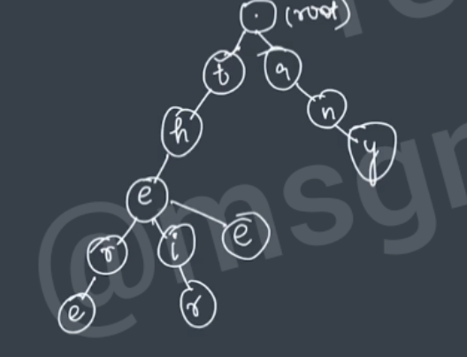

# Trie Data Structure

Also known as prefix
There 
The
Their

Works on prefix

apple
app

Share common prefix
Retrieval Tree
Digital Tree


## What is Trie Data Structure
K - array Tree
Multiple ptrs
Time Complexity is comparably minimum

```java
words[] ={"the","a","there","their","any","thee"}
```


## Data Structure
```java

class Node{
  Node[] children;
  boolean endOfWord;
}
```